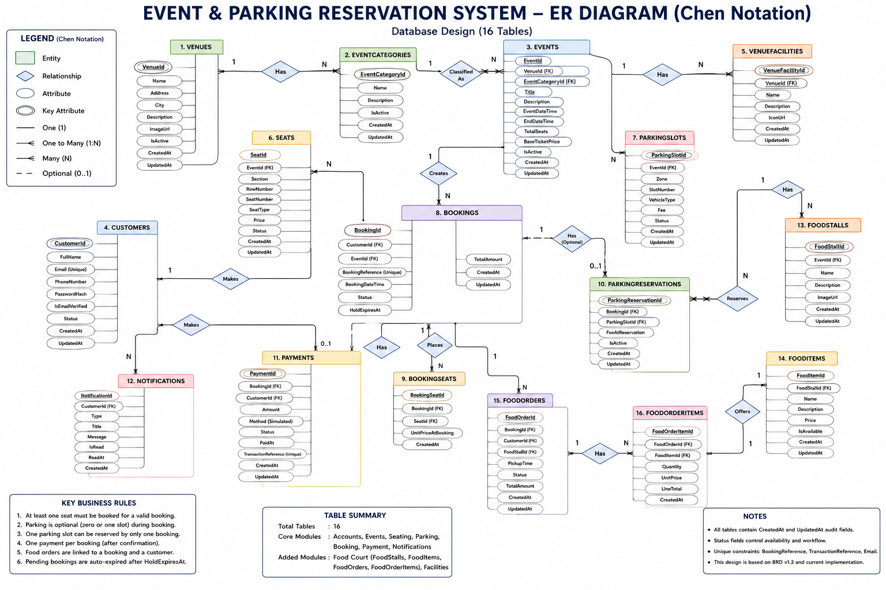

# Database Design

## 1. Overview

The Event Parking Reservation System uses Microsoft SQL Server with Entity Framework Core.

The database supports the following major functional areas:

- Customer accounts and authentication
- Venue and event management
- Venue facilities
- Seat management
- Parking management
- Booking and reservation processing
- Payment processing
- Customer notifications
- Food court management and food pre-orders

The current database contains 16 main application tables.

---

## 2. Database Tables

### Core Entities

1. Customers
2. Venues
3. EventCategories
4. Events
5. Seats
6. ParkingSlots
7. Bookings
8. BookingSeats
9. ParkingReservations
10. Payments
11. Notifications

### Extended Entities

12. VenueFacilities
13. FoodStalls
14. FoodItems
15. FoodOrders
16. FoodOrderItems

---

## 3. Common Audit Fields

All main entities inherit common audit properties from `BaseEntity`:

- `Id` — Primary Key
- `CreatedAt` — record creation timestamp
- `UpdatedAt` — optional last update timestamp

These fields provide consistent record identification and audit tracking.

---

## 4. Main Entity Relationships

### Venue and Event

```text
Venue 1 ---- N Events
EventCategory 1 ---- N Events
Venue 1 ---- N VenueFacilities
```

A venue can host multiple events and contain multiple facilities.

An event belongs to one venue and one event category.

---

### Event Resources

```text
Event 1 ---- N Seats
Event 1 ---- N ParkingSlots
Event 1 ---- N Bookings
Event 1 ---- N FoodStalls
```

Seats and parking slots are event-specific resources.

---

### Customer and Booking

```text
Customer 1 ---- N Bookings
Event    1 ---- N Bookings
```

Each booking belongs to one customer and one event.

---

### Booking and Seats

```text
Booking 1 ---- N BookingSeats
Seat    1 ---- N BookingSeats
```

`BookingSeats` acts as the junction entity between bookings and seats.

It also stores the seat price used at the time of booking through `UnitPriceAtBooking`.

---

### Booking and Parking

```text
Booking     1 ---- 0..1 ParkingReservation
ParkingSlot 1 ---- N ParkingReservations
```

Parking is optional during booking.

A parking reservation records the parking fee applicable when the reservation is made and maintains its active state.

---

### Booking and Payment

```text
Booking  1 ---- 0..1 Payment
Customer 1 ---- N Payments
```

Payment is linked to the corresponding booking and customer.

---

### Customer Notifications

```text
Customer 1 ---- N Notifications
```

Notifications record customer-related system messages and their read status.

---

### Food Court

```text
Event     1 ---- N FoodStalls
FoodStall 1 ---- N FoodItems
FoodStall 1 ---- N FoodOrders

Booking   1 ---- N FoodOrders
Customer  1 ---- N FoodOrders
```

Food orders are linked to an existing booking, customer, and food stall.

---

### Food Order Items

```text
FoodOrder 1 ---- N FoodOrderItems
FoodItem  1 ---- N FoodOrderItems
```

`FoodOrderItems` acts as the junction entity between a food order and selected food items.

It stores:

- Quantity
- Unit price
- Line total

This preserves the financial values used when the order is created.

---

## 5. Junction Entities

The database contains two important junction entities.

### BookingSeats

Connects:

```text
Bookings <---- BookingSeats ----> Seats
```

Purpose:

- associates selected seats with a booking
- preserves the seat price at booking time

### FoodOrderItems

Connects:

```text
FoodOrders <---- FoodOrderItems ----> FoodItems
```

Purpose:

- associates food items with an order
- stores quantity
- stores unit price
- stores line total

---

## 6. Key Database Design Rules

The database design supports the following important rules:

- A booking belongs to one customer and one event.
- A valid booking contains selected seat information.
- Parking is optional for a booking.
- Parking availability is controlled through parking reservation state.
- Payment is associated with the corresponding booking and customer.
- Notifications belong to individual customers.
- Food orders must be associated with a booking and customer.
- Food order items preserve ordering-time price information.
- Venue facilities provide guidance information and are not reservable resources.
- Event seats and parking slots are managed independently for each event.

---

## 7. Entity Framework Core

The application uses Entity Framework Core for database access.

The `ApplicationDbContext` defines the application tables through `DbSet<TEntity>` properties.

Entity-specific database rules are maintained using separate Entity Framework Core configuration classes and loaded through:

```csharp
modelBuilder.ApplyConfigurationsFromAssembly(
    typeof(ApplicationDbContext).Assembly);
```

This keeps database constraints and relationships separated from the entity models.

---

## 8. Database Migrations

Database schema changes are maintained through Entity Framework Core migrations.

Existing migrations include the initial schema and later additions for features such as:

- Venue facilities
- Parking fee override support
- Food court entities
- Parking reservation active-state handling

For a clean local setup, existing migrations should be applied rather than creating a new migration.

Example using Visual Studio Package Manager Console:

```powershell
Update-Database -Project EventParking.DataAccess -StartupProject EventParking.Api
```

---

## 9. ER Diagram

The final Entity Relationship Diagram uses Chen notation to represent:

- Entities
- Relationships
- Attributes
- Primary keys
- Cardinalities

The ER diagram covers all 16 application entities and their relationships.

### Final Chen Notation ER Diagram



## 10. Database Design Status

```text
Database Engine        : SQL Server
ORM                    : Entity Framework Core
Main Application Tables: 16
Primary Key Strategy   : Integer Id
Audit Fields           : CreatedAt, UpdatedAt
Schema Management      : EF Core Migrations
Status                 : Final integrated backend design
```


